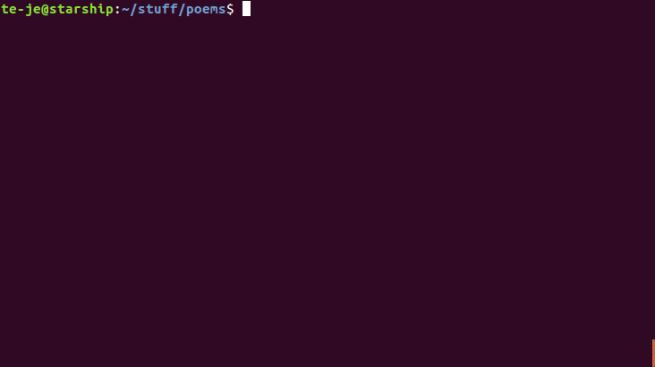

fargo
=====

|license|

Fargo is a command-line *find and replace* processor for Git repositories.
It scans all the tracked files in a git repo and performs substitutions
based on input.

.. note:: If you're looking for a tool to do searches *without* substitutions,
  then you should try the ``git grep`` command which already comes with Git.

.. contents:: Contents

Installation
------------

You can install fargo directly from GitHub::

  pip install git+https://github.com/te-je/fargo

That should install all the dependencies for you. If you want to install
directly from source, clone the git repository and run the standard
`python setup.py install` command.

Dependencies
~~~~~~~~~~~~

* Python 3.5+

Usage
-----

::

  fargo [-i] <text> [<substitution>] [<repository>]

The program scans the tracked files inside a local git repository found at
``<repository>`` and replaces all occurrences of ``<text>`` with
``<substitution>``.

==================  ===========================================   =======================================
Option/Argument     Description                                   Default
==================  ===========================================   =======================================
``<text>``          This is the text that is scanned inside the
                    Git repository.
------------------  -------------------------------------------   ---------------------------------------
``<substitution>``  Occurrences of ``<text>`` will be replaced    If this is omitted, then occrrences of
                    by this.                                      ``<text>`` are **removed**.
------------------  -------------------------------------------   ---------------------------------------
``<repository>``    A local Git repository that is scanned for    If not given, the current directory is
                    occurrences of ``<text>``.                    used (must be a Git repository).
------------------  -------------------------------------------   ---------------------------------------
``-i``              Run in interactive mode.
==================  ===========================================   =======================================

Interactive mode
~~~~~~~~~~~~~~~~

Interactive mode is turned on using the ``-i`` switch. In interactive mode,
fargo prompts on *stdin* before substitutions on each line where the search
text was found::

  > fargo -i foo bar
  ./example.rst:L14:You'll find several examples in the |0|foo|bar|ter on
  Accept replacements? [yes]: ‸

Breaking this down, the first part of the prompt identifies the file
(``./example.rst``) and line number (14) where the text was found. It's followed
by the full line of text for context. Within the line, there's one
candidate substition consisting of three blocks: ``|0|foo|bar|``. The first
block is the sequence number of the substitution on the line (more about this
below). The second block is the text that was matched, and the third block is
the text that it is about to be replaced with. Finally, there's the prompt
about what to do with the line (``Accept Replacements? [yes]: ‸``). Entering
either ``yes`` or ``no`` will accept or reject the line changes.

Sometimes, there might be more than one substitution possible on the same line::

  > fargo -i me ME
  ./chatlog.txt:L2: is not the sa|0|me|ME| as |1|me|ME|eting |2|me|ME| in person. It's
  Accept replacements? [yes]: ‸

Instead of accepting or rejecting all of the subsitutions wholesale, specific
substitutions can be accepted by entering a space separated list of their
sequence numbers. For example, entering ``2`` above will result in the line:
:literal:`\ is not the same as meeting ME in person. It's`.

Unicode support
~~~~~~~~~~~~~~~

Fargo supports unicode text subsitutions. Sort of. Fargo tries to guess the
encoding of every file that it reads (using chardet). If it can't make a
confident guess, then the file is ignored.

In cases where Fargo makes substitutions that can't be re-encoded with the
original encoding, then the subsitutions are ignored and the file is left
untouched.

.. |build-status| image:: https://travis-ci.org/te-je/fargo.svg?branch=develop
    :target: https://travis-ci.org/te-je/fargo/branches
    :alt: build status
    :scale: 100%

.. |license| image:: https://img.shields.io/badge/license-MIT-blue.svg
    :target: https://raw.githubusercontent.com/te-je/fargo/develop/LICENSE.txt
    :alt: License
    :scale: 100%
